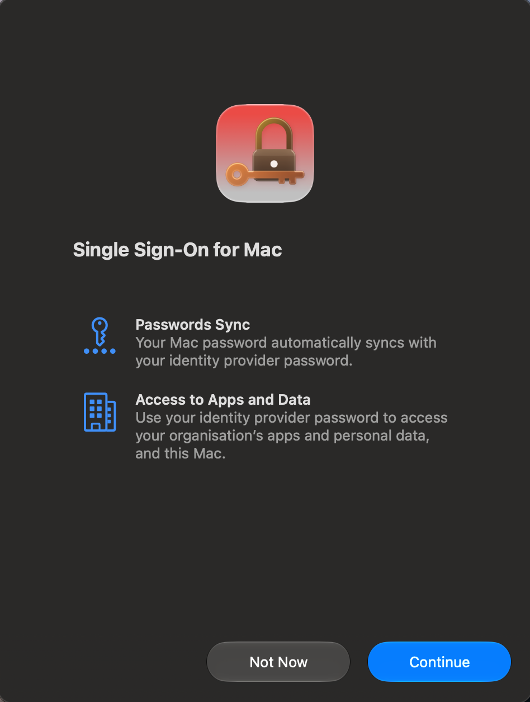
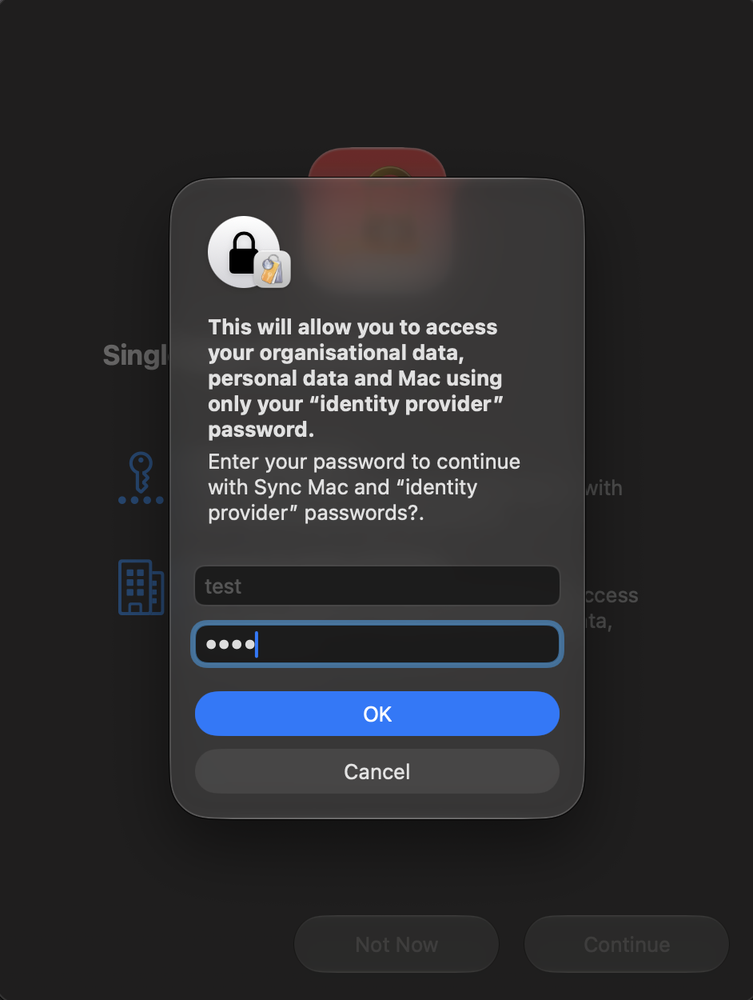
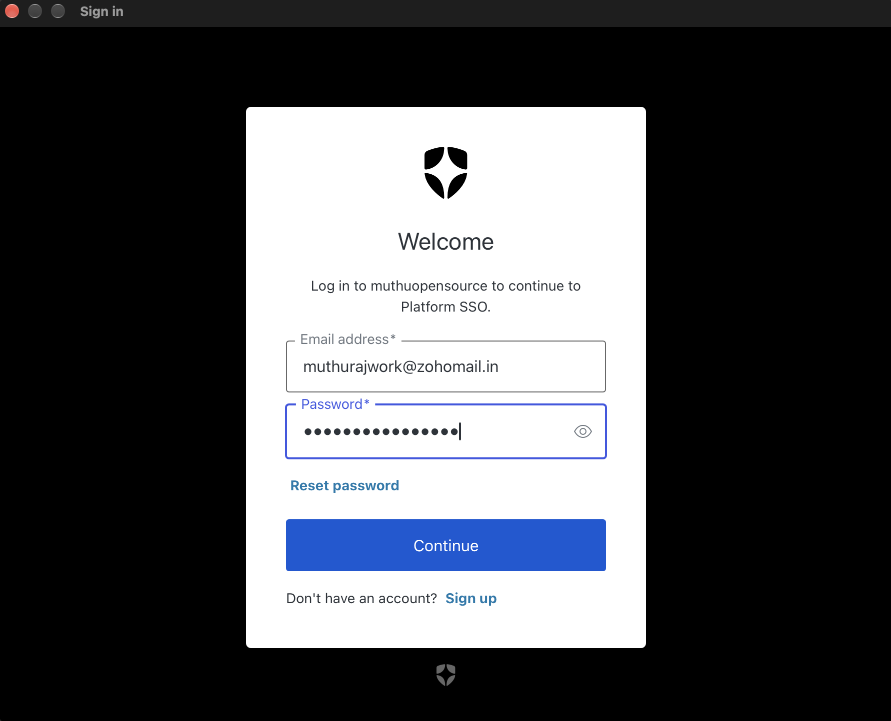
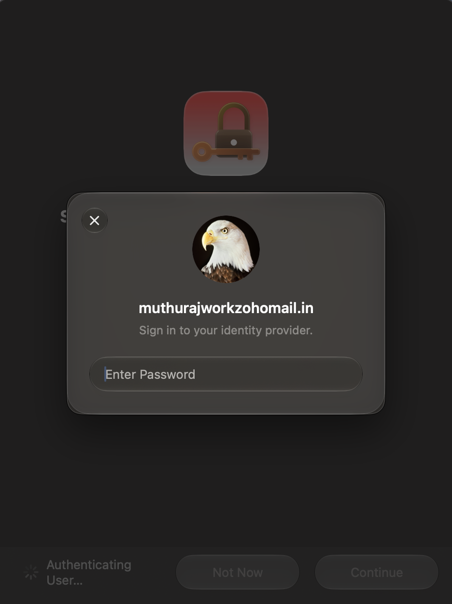
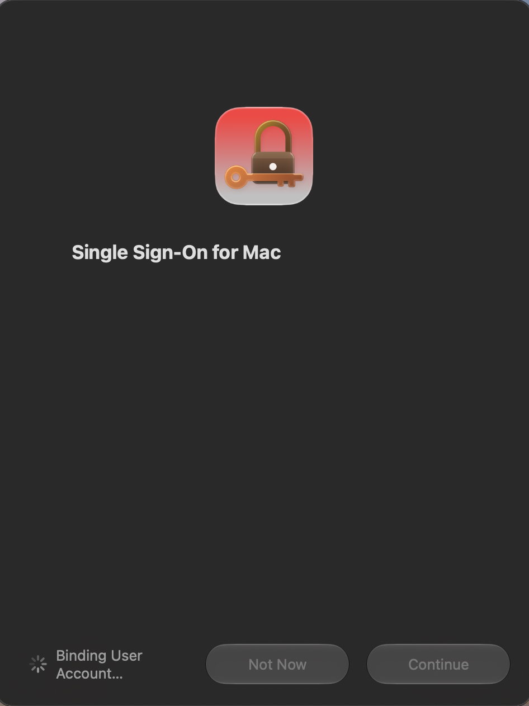
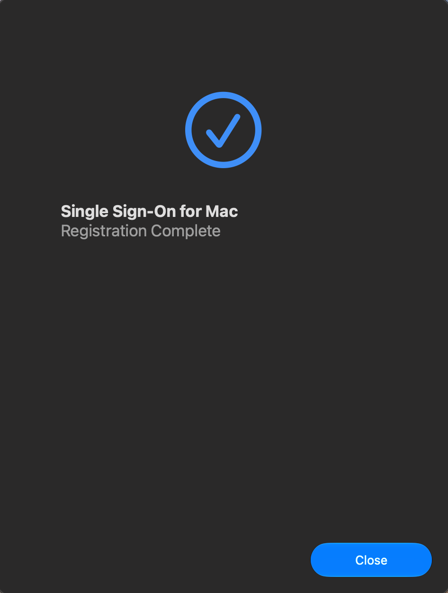
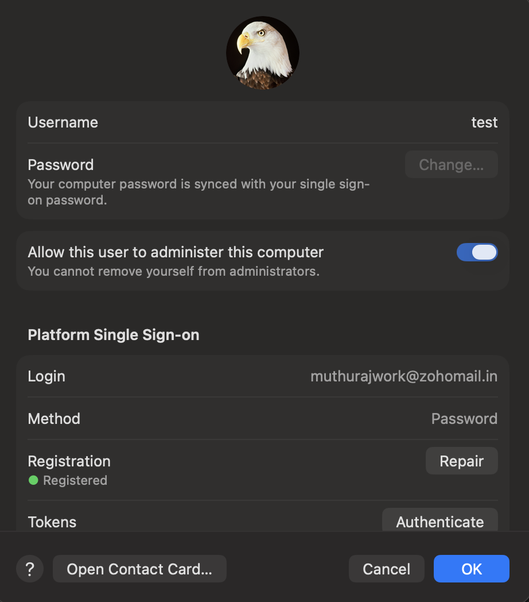

# Platform Single Sign-On (PSSO) Client for macOS

- Prominent Identity Providers like Okta, Microsoft EntraID, Ping Identity Provides Support for Apple's Platform SSO Framework which supports Password Authentication Method to Sync the Password to macOS Local Account


- **`psso-client-swiftui`** is a native macOS client application and Platform SSO Extension implementing Apple's **Password Authentication Type**. that provides **Local Account Password Synchronization** with any OIDC Providers that Supports Resource Owner Password Grant `grant_type`. 

- This Project can be utilized with Identity Providers that have not supported PSSO Still and have no other tools for Syncing Password to macOS Local Account ( Eg: Auth0, Onelogin, AWS Cognito etc.,)

This repository works in conjunction with the companion proxy server:  
👉 [psso-idp-proxy-server-java](https://github.com/Muthu-Opensource-Solutions/psso-idp-proxy-server-java)

---

## Requirements

- **macOS**: 15.0 or later.
- **MDM Solution**: Any modern MDM (Jamf Pro, Microsoft Intune, ManageEngine EndpointCentral, Mosyle, etc.).
- **Backend Service**: An active deployment of [psso-idp-proxy-server-java](https://github.com/Muthu-Opensource-Solutions/psso-idp-proxy-server-java).

---

## 1. Deploy the Application Package

1. Download the latest `.pkg` installer from [GitHub Releases](https://github.com/Muthu-Opensource-Solutions/psso-client-swiftui/releases).
2. Distribute the package to target Macs via your MDM (Jamf Pro, Intune, Endpoint Central, Mosyle, etc.).
3. The package installs the host app and bundled Platform SSO extension to `/Applications/psso-client-swiftui.app`.

---

## 2. Deploy the MDM Configuration Profile

Deploy a configuration profile (`.mobileconfig`) containing the **Extensible Single Sign-On** and **Associated Domains** payloads using your MDM.

### Sample `mobileconfig`

```xml
<?xml version="1.0" encoding="UTF-8"?>
<!DOCTYPE plist PUBLIC "-//Apple//DTD PLIST 1.0//EN" "http://www.apple.com/DTDs/PropertyList-1.0.dtd">
<plist version="1.0">
<dict>
    <key>PayloadContent</key>
    <array>
        <!-- Platform SSO Payload -->
        <dict>
            <key>AuthenticationMethod</key>
            <string>Password</string>
            <key>ExtensionIdentifier</key>
            <string>com.muthuopensource.psso-client-swiftui.ssoe</string>
            <key>PayloadDisplayName</key>
            <string>SSOE muthuopensource</string>
            <key>PayloadIdentifier</key>
            <string>com.apple.extensiblessoD5AC0626-265B-406F-9497-567D8CD58B0A</string>
            <key>PayloadType</key>
            <string>com.apple.extensiblesso</string>
            <key>PayloadUUID</key>
            <string>CDC67F3E-0687-4796-95B0-A61EF6F3F9A7</string>
            <key>PayloadVersion</key>
            <integer>1</integer>
            <key>TeamIdentifier</key>
            <string>84V944P795</string>
            <key>Type</key>
            <string>Redirect</string>
            <key>URLs</key>
            <array>
                <string>https://<DOMAIN_FQDN>/psso/token</string>
                <string>https://<DOMAIN_FQDN>/psso/jwks</string>
                <string>https://<DOMAIN_FQDN>/psso/nonce</string>
                <string>https://<DOMAIN_FQDN>/psso/key</string>
                <string>https://<DOMAIN_FQDN>/psso/refresh</string>
            </array>
            <key>PlatformSSO</key>
            <dict>
                <key>AuthenticationMethod</key>
                <string>Password</string>
                <key>UseSharedDeviceKeys</key>
                <true/>
                <!-- Set to true to create Ondemand Local Account from macOS Login Window-->
                <key>EnableCreateUserAtLogin</key>
                <false/>
            </dict>
            <key>ExtensionData</key>
            <dict>
                <key>DOMAIN_FQDN</key>
                <string><DOMAIN_FQDN></string>
            </dict>
            <key>RegistrationToken</key>
            <string><PSSO_HMAC_SECRET_KEY></string>
        </dict>

        <!-- Associated Domains Payload -->
        <dict>
            <key>Configuration</key>
            <array>
                <dict>
                    <key>ApplicationIdentifier</key>
                    <string>84V944P795.com.muthuopensource.psso-client-swiftui</string>
                    <key>AssociatedDomains</key>
                    <array>
                        <!-- Add ?mode=managed if domain cannot be reached by Apple CDNs, you can remove ?mode=managed if <DOMAIN_FQDN> is reachable through internet-->
                        <string>authsrv:<DOMAIN_FQDN>?mode=managed</string>
                    </array>
                    <key>EnableDirectDownloads</key>
                    <true/>
                </dict>
            </array>
            <key>PayloadDisplayName</key>
            <string>Associated Domains</string>
            <key>PayloadIdentifier</key>
            <string>com.apple.associated-domains.A285336E-DF6D-4C3C-922D-78C026A56197</string>
            <key>PayloadType</key>
            <string>com.apple.associated-domains</string>
            <key>PayloadUUID</key>
            <string>A285336E-DF6D-4C3C-922D-78C026A56197</string>
            <key>PayloadVersion</key>
            <integer>1</integer>
        </dict>
    </array>
    <key>PayloadDisplayName</key>
    <string>SSOE</string>
    <key>PayloadIdentifier</key>
    <string>mdscentral.CDC67F3E-0687-4796-95B0-A61EF6F3F9A7</string>
    <key>PayloadScope</key>
    <string>System</string>
    <key>PayloadType</key>
    <string>Configuration</string>
    <key>PayloadUUID</key>
    <string>0DC6670F-F853-49CB-91B3-1C5ECB5D3F46</string>
    <key>PayloadVersion</key>
    <integer>1</integer>
</dict>
</plist>
```

### Configuration Notes

- **`<DOMAIN_FQDN>`**: The domain of your `psso-idp-proxy-server-java` instance.
- **`<PSSO_HMAC_SECRET_KEY>`**: The shared HMAC secret key configured on `psso-idp-proxy-server-java`.
- **`UseSharedDeviceKeys`**: **Must be set to `true`**.
- **`EnableCreateUserAtLogin`**: Set to **`true`** or **`false`** based on your organization's preference for provisioning new local accounts directly from the login window.
- **`mode=managed` (Internal Networks)**: If your domain is hosted on an internal corporate network/intranet and cannot be reached by Apple's public CDN servers, configure `authsrv:<DOMAIN_FQDN>?mode=managed` and ensure `<key>EnableDirectDownloads</key><true/>` is present. This instructs macOS to download the association file directly from your server. *(Details on serving `apple-app-site-association` are documented in the [server repository](https://github.com/Muthu-Opensource-Solutions/psso-idp-proxy-server-java)).*

## 3. Visual Walkthrough (Admin & User Experience)

Below is the complete enrollment and synchronization lifecycle experienced by IT administrators and end users:

### 1) Device Registration

When the MDM configuration profile is pushed, macOS initiates device registration with the Platform SSO extension:

<p align="center">
  
</p>

The user is prompted to register the Mac with the enterprise identity platform:

<p align="center">
  
</p>

The device hardware keys and identity are verified:

<p align="center">
  
</p>

---

### 2) User Registration

The user signs in to link their local macOS account with their Identity Provider (IdP) account:

<p align="center">
  
</p>

The user provides their IdP credentials for authentication:

<p align="center">
  
</p>

---

### 3) Key Exchange

The client performs secure, hardware-bound cryptographic key exchange with the companion proxy server:

<p align="center">
  
</p>

---

### 4) Completion

Registration completes successfully, binding the user and device to the Platform SSO extension:

<p align="center">
  
</p>

---

### 5) Password Sync

Password synchronization is now active between the Identity Provider and the local macOS account:

<p align="center">
  
</p>

- The user's Identity Provider (IdP) password is synchronized to their local macOS user account.
- If the user changes their password in the IdP, they can seamlessly sync the new password to their Mac by entering the **new IdP password at the macOS login window**. PSSO verifies the new password against the IdP via the proxy server and updates the local account password.

---

### 6) Users & Groups Pane

In **System Settings > Users & Groups**, the local user account shows the active Platform SSO badge and enrollment status:

<p align="center">
  
</p>

---

## Repositories & References

- **Companion Server**: [Muthu-Opensource-Solutions/psso-idp-proxy-server-java](https://github.com/Muthu-Opensource-Solutions/psso-idp-proxy-server-java)
- **Client Releases**: [psso-client-swiftui Releases](https://github.com/Muthu-Opensource-Solutions/psso-client-swiftui/releases)
- **Apple Documentation**: [Platform Single Sign-On (SSO)](https://developer.apple.com/documentation/authenticationservices/platform-single-sign-on-sso)


## Commercials & Consultation

For any commercial inquiries, custom deployments, or professional consultation, please reach out at:
📧 **[muthurajwork@zohomail.in](mailto:muthurajwork@zohomail.in)**
